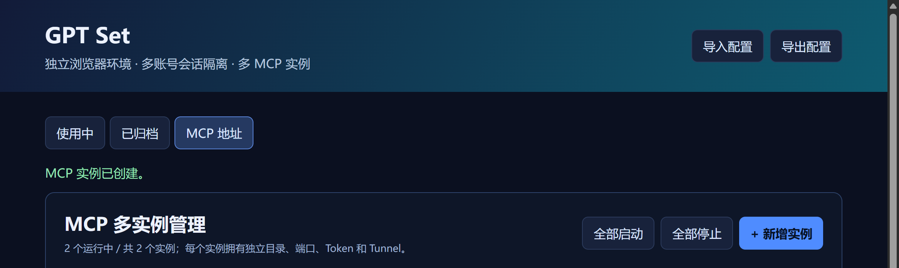

<div align="center">

# GPT Set

### Windows 多账号 ChatGPT 客户端与本地 MCP 工作台

用独立 Chromium 环境隔离 ChatGPT 登录会话；为每个环境绑定独立的本地 MCP 文件工作区与图片桥接扩展。

[](https://github.com/xieguu/gpt-set/releases)
[](https://github.com/xieguu/gpt-set/releases)
[](https://nodejs.org/)
[](LICENSE)

[下载发布版](https://github.com/xieguu/gpt-set/releases) · [问题反馈](https://github.com/xieguu/gpt-set/issues) · [架构设计](设计说明.md)

</div>

## 界面预览 🖥️



## 核心能力 🎯

- [x] **多账号环境隔离**：每个环境拥有独立 Cookie、LocalStorage、IndexedDB、缓存和 Service Worker。
- [x] **登录态迁移**：可批量导入、导出环境 Cookie；文件格式严格校验，失败时自动回滚新环境。
- [x] **代理独立配置**：环境可使用系统代理，或设置 HTTP / HTTPS / SOCKS 代理。
- [x] **本地 MCP 多实例**：每个实例独立管理工作目录、端口、Token、进程和 Cloudflare Quick Tunnel。
- [x] **安全文件操作**：MCP 只访问指定工作目录；拒绝绝对路径、`..` 越界和符号链接。
- [x] **图片桥接**：自动捕获 ChatGPT 生成图片，并投递至对应 MCP 工作区的收件箱。
- [x] **可靠配置存储**：环境与 MCP 配置使用原子写入、BOM 兼容和 `.bak` 自动恢复。
- [x] **便携式发布**：可构建为无需安装 Node.js 的 Windows x64 单文件 EXE。

## 快速开始 🚀

### 使用 Windows 便携版

从 [Releases](https://github.com/xieguu/gpt-set/releases) 下载 `GPT-Set-*-portable.exe`，放到一个长期保留的普通目录（例如 `D:\Apps\GPT-Set`）并双击运行。

无需安装 Node.js 或 npm。升级时先完全退出 GPT Set，再用新 EXE 替换旧版。

> 便携版仅指程序无需安装。会话与配置仍保存在 `%APPDATA%\gpt-set-client`；备份时请在程序退出后复制该目录。

### 从源码运行

前提：Windows 10/11、Node.js 20+、npm。公网访问 MCP 时另需可选的 `cloudflared`。

```powershell
git clone https://github.com/xieguu/gpt-set.git
cd gpt-set\client
npm install
npm start
```

首次启动会迁移已有的 `local-mcp-server\.env` 默认配置，并创建 MCP 多实例配置；已有浏览器 partition 和登录状态会保留。

## MCP 工作流 🔌

1. 在主界面打开 **MCP 地址**，新增实例并选择允许访问的本地目录。
2. 指定 `1024–65535` 端口，或使用 **自动端口**。
3. 保存后启动实例；启动结果会通过带鉴权的 `/health` 进行校验。
4. 需要让 ChatGPT 网页端访问时，启动 Tunnel 并复制生成的 MCP 地址。
5. 在新建或编辑浏览器环境时绑定该 MCP 实例，GPT Set 会自动写入并加载该环境的图片桥接扩展。

本地实例可并行运行：

```text
http://127.0.0.1:8787/mcp
http://127.0.0.1:8788/mcp
```

Quick Tunnel 地址会在进程重启后变化；需要固定域名请使用 Cloudflare Named Tunnel。

## MCP 工具 🧰

| 工具 | 用途 |
| --- | --- |
| `list_directory` / `get_file_info` | 查看目录与文件元数据 |
| `read_file` / `write_text` | 读取、创建或覆盖 UTF-8 文本 |
| `write_image` / `save_image_from_url` | 写入 Base64 图片或保存公开 HTTPS 图片 |
| `create_directory` / `move_path` / `delete_path` | 创建、移动、重命名或确认删除路径 |
| `list_captured_images` / `save_captured_image` | 查看并保存扩展捕获的 ChatGPT 图片 |

支持读取或写入 PNG、JPEG、WebP、GIF；图片捕获包含队列、并发限制、失败重试和有界去重。

## 构建发布包 📦

```powershell
cd client
npm ci
npm run check
npm test
npm run dist:win
```

产物位于 `client\dist\GPT-Set-0.1.0-portable.exe`。发布前可生成校验值：

```powershell
Get-FileHash .\client\dist\GPT-Set-0.1.0-portable.exe -Algorithm SHA256
```

## 项目结构 📁

```text
client/                          Electron 客户端与 MCP 进程管理器
local-mcp-server/                Streamable HTTP 本地文件 MCP 服务
chatgpt-image-bridge-extension/  ChatGPT 图片捕获扩展
设计说明.md                       架构设计文档
```

## 数据与安全 🔐

```text
%APPDATA%\gpt-set-client\environments.json       浏览器环境元数据
%APPDATA%\gpt-set-client\mcp-instances.json      MCP 实例配置
%APPDATA%\gpt-set-client\Partitions\             登录会话数据
%APPDATA%\gpt-set-client\extensions\             环境专属扩展副本
```

“导入配置 / 导出配置”只处理环境元数据，不包含登录状态。“导入登录态 / 导出登录态”会迁移 Cookie，并为每条导入记录创建新的独立环境。登录态文件等同账号凭据，请只保存在可信位置，不要提交到 Git 或发送给他人。

- MCP 默认只监听 `127.0.0.1`，对外暴露必须显式启动 Tunnel。
- 每个 MCP 实例默认使用独立高熵 Bearer Token。
- 删除必须显式传入 `confirm=true`。
- 不要提交 `mcp-instances.json`、`.env`、公网 Token 或 `%APPDATA%` 会话目录；查询 Token 泄露后应立即轮换。

## 开发验证

```powershell
npm run check --prefix client
npm test --prefix client
npm test --prefix local-mcp-server
```

## License

[MIT](LICENSE)
